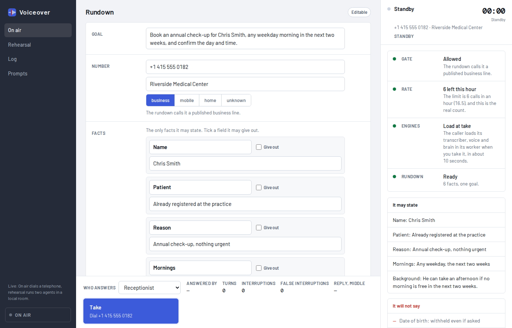

<picture>
  <source media="(prefers-color-scheme: dark)" srcset="design/lockup-dark.svg">
  
</picture>

Voiceover makes a telephone call for you. You write a rundown: one goal, the
facts it may state, the number. It dials, holds an open conversation toward
the goal, and comes back with a report. It says only what you wrote down.



## Install

```
git clone git@github.com:crsmithdev/voiceover.git
cd voiceover && bun install
bun scripts/setup-trunk.ts     # build the LiveKit half of the trunk, once
```

Requires Bun, a LiveKit Cloud project with a SIP trunk to Telnyx, an
OpenRouter key, and the [Sidetone](https://github.com/crsmithdev/sidetone)
voice bridge on a local GPU. Rehearsals also need Docker, for a local LiveKit
server on port 7890.

## Quick start

```
bun scripts/ui.ts          # the console, http://127.0.0.1:3002
bun scripts/rehearse.ts    # the scripted rehearsal suite, no telephone
bun scripts/test-call.ts   # dial, say one sentence, hang up
```

Start with a rehearsal. The caller runs against a test receiver in a local
room, so a prompt change is tested without a browser or a phone.

## A call

1. **Rundown.** One goal. Key-value facts, each with a "give out" tick. A
   background note. The number and what kind of line it is. The rundown is
   not stored; it lives only for the call.
2. **Gate.** Before it dials: the number is one you own or a business line
   the rundown asserts, the hourly rate limit has room, the speech engines
   are warm. Anything else is refused.
3. **On air.** The phase (dialing, listening, thinking, speaking,
   interrupted, on hold, working a menu, transferring, closing), who
   answered (person, voicemail, menu, unknown), the transcript as it
   streams, and the clock against an 8 minute soft limit and a 12 minute
   hard limit. A hang-up key is always in reach.
4. **Report.** Outcome and reason. Who answered. Duration. What was said
   and heard. What was blocked and needs you. Per-turn latency, with the
   end-of-turn pause on its own line, because that pause is a setting, not
   a cost. A call does not end without a report. Reports are kept for 30
   days.

## The rule

An agent that speaks for you can do worse than fail. It can state a wrong
fact with confidence, in your name, to a stranger. Voiceover treats that as
the worst outcome, worse than a call that gets nowhere.

The boundary is mechanical, not a polite request in a prompt. A fact you did
not tick "give out" never reaches the model. A sensitive field (a card
number, a date of birth, an account number) is withheld unless you tick it,
and the model is told only that the field exists and that you hold it. It
cannot read the digits out under pressure, because it was never given them.

The console shows the boundary before, during and after the call: what it
may state, what it will not say, and what it refused when asked.

Three rules never change. It opens by saying it is an assistant calling for
you. It says yes when asked if it is a machine. It never says it is you.
Audio is not recorded.

## Rehearsal

No telephone. Ten receivers to pick from: receptionist, slow talker, hard of
hearing, busy, irritable, chatty, new employee, fighting the phones,
voicemail machine, menu system. Provoke events while it runs: talk over it,
cough, ask if it is a machine, ask for a fact it does not have, go quiet,
transfer it. Take over as the other party by keyboard. Read the last turn
split into end-of-turn wait, transcriber, brain and voice.

`scripts/rehearse.ts` runs the same rehearsals as a scripted suite and
asserts on the report.

## Configuration

`.env` holds the keys and is not in the repository:

| Key | What it is |
| --- | --- |
| `LIVEKIT_URL`, `LIVEKIT_API_KEY`, `LIVEKIT_API_SECRET`, `LIVEKIT_TRUNK_ID` | The LiveKit Cloud project and its outbound trunk |
| `TELNYX_API_KEY`, `TELNYX_CONNECTION_ID`, `TELNYX_NUMBER`, `TELNYX_SIP_USERNAME`, `TELNYX_SIP_PASSWORD` | The Telnyx side of the trunk |
| `OPENROUTER_API_KEY` | The brain |
| `VOICEOVER_BRAIN`, `VOICEOVER_BRAIN_BASE_URL` | The model and endpoint the brain uses |
| `VOICEOVER_TTS` | `piper` falls back from Kokoro for the voice |
| `VOICEOVER_OWNED_NUMBERS` | Numbers the gate passes without a line-type check |
| `VOICEOVER_TEST_NUMBER` | Where `test-call.ts` and `call.ts` dial by default |

Reports, rehearsal logs, edited prompts and the dial history live under
`~/.voiceover`.

## Stack

- Bun and TypeScript. `@livekit/agents` 1.8.1 supplies the turn detector,
  the interruption handling, the answering machine detection and the menu
  tones. Voiceover configures these; it does not build them.
- Telephony is a LiveKit Cloud SIP trunk to Telnyx. One concurrent call.
- The brain is Claude Haiku 4.5 over OpenRouter by default.
- Speech runs on the local GPU through the Sidetone voice bridge workers:
  faster-whisper for transcription, Kokoro for the voice, Piper as the
  fallback.
- Nothing but the brain makes a paid network call on the hot path.

## When not to use it

- You want a call centre. Voiceover holds one call at a time.
- You want the agent to improvise. It states only the facts you ticked, and
  it refuses the rest out loud.
- You want it to pass for you. It says it is an assistant, and it says yes
  when asked if it is a machine.
- You want a recording. Audio is never written to disk, only the transcript.
- You do not have a GPU on the machine, or a Sidetone bridge to reach. The
  speech path is local by design.

## Layout

| Path | Contents |
| --- | --- |
| `src/call` | The rundown, the gate, the rate limit, the state machine, the report |
| `src/rehearsal` | The test receivers and the local room |
| `src/speech` | The transcriber and the voices, as framework adapters |
| `scripts` | The console server and the command-line runs |
| `design/voiceover.html` | The console, one self-contained page |
| `design/mark.svg`, `design/lockup-*.svg` | The mark, and the lockup with the word as outlines |
| `docs/spec.md` | The product specification: the rules, the latency model, the measurements, the open points |
| `DESIGN.md` | The design system for the console |
| `test` | Unit tests |

## Development

```
bun test
bun run typecheck
bun scripts/voices.ts      # render the Kokoro voices to pick one by ear
```

## Status

Voiceover is built by one person, for one person, one call at a time. It
assumes the author's machine: the voice bridge, the GPU, the local LiveKit
server. Real calls so far are test calls to numbers the author owns. Every
transcript in the console's samples is synthetic and labelled so.
